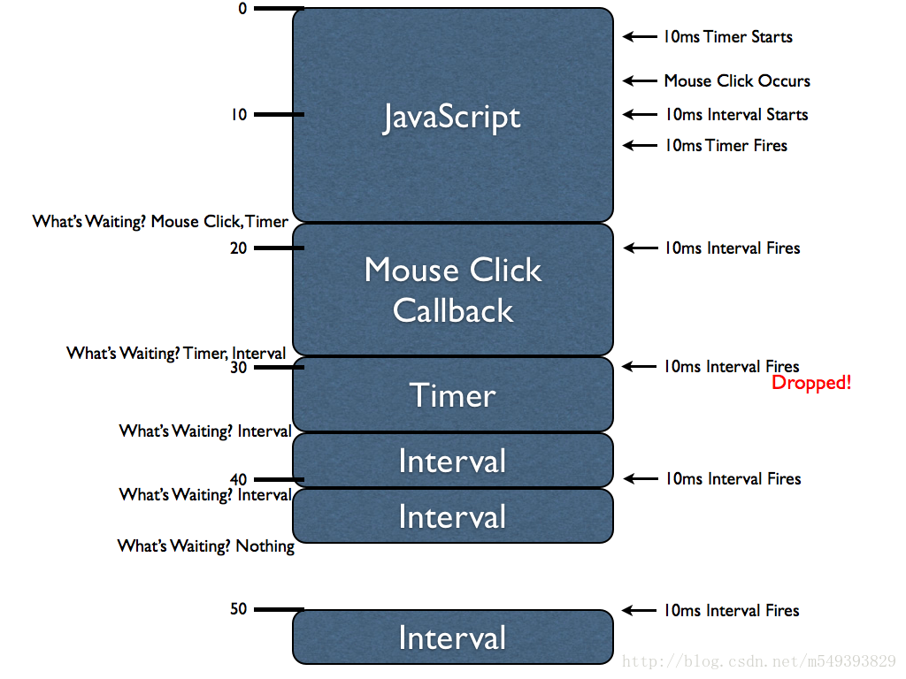

# JS异步处理工作机制(setTimeout, setInterval)

从基础的层面来讲，理解JavaScript的定时器是如何工作的是非常重要的。计时器的执行常常和我们的直观想象不同，那是因为JavaScript引擎是单线程的。我们先来认识一下下面三个函数是如何控制计时器的。

- `var id = setTimeout(fn, delay);` : 初始化一个计时器，然后在指定的时间间隔后执行。该函数返回一个唯一的标志ID（Number类型），我们可以使用它来取消计时器。
- `var id = setInterval(fn, delay); `: 和setTimeout有些类似，但它是连续调用一个函数（时间间隔是delay参数）直到它被取消。
- `clearInterval(id);, clearTimeout(id);` : 使用计时器ID（setTimeout 和 setInterval的返回值）来取消计时器回调的发生

为了理解计时器的内在执行原理，有一个重要的概念需要加以探讨：计时器的延迟(delay)是无法得到保障的。由于所有JavaScript代码是在一个线程里执行的，所有异步事件（例如，鼠标点击和计时器）只有拥有执行机会时才会执行。用一个很好的图表加以说明：



在这个图表中有许多信息需要理解，如果完全理解了它们，你会对JavaScript引擎如何实现异步事件有一个很好的认识。这是一个一维图：垂直方向表示时间，蓝色的区块表示JavaScript代码执行块。例如第一个JavaScript代码执行块需要大约18ms，鼠标点击所触发的代码执行 块需要11ms，等等。

由于JavaScript引擎同一时间只执行一条代码（这是由于JavaScript单线程的性质），所以每一个JavaScript代码执行块会 “阻塞”其它异步事件的执行。这就意味着当一个异步事件发生（例如，鼠标点击，计时器被触发，或者Ajax异步请求）后，这些事件的回调函数将排在执行队 列的最后等待执行（实际上，排队的方式根据浏览器的不同而不同，所以这里只是一个简化）；

从第一个JavaScript执行块开始研究，在第一个执行块中两个计时器被初始化：一个10ms的setTimeout()和一个10ms的setInterval()。 依据何时何地计时器被初始化(计时器初始化完毕后就会开始计时)，计时器实际上会在第一个代码块执行完毕前被触发。但是，计时器上绑定的函数不会立即执行 （不被立即执行的原因是JavaScript是单线程的）。实际上，被延迟的函数将依次排在执行队列的最后，等待下一次恰当的时间再执行。

此外，在第一个JavaScript执行块中我们看到了一个“鼠标点击”事件发生了。一个JavaScript回调函数绑定在这个异步事件上了（我 们从来不知道用户什么时候执行这个（点击）事件，因此认为它是异步的），这个函数不会被立即执行，和上面的计时器一样，它将排在执行队列的最后，等待下一 次恰当的时候执行。

当第一个JavaScript执行块执行完毕后，浏览器会立即问一个问题：哪个函数（语句）在等待被执行？在这时，一个“鼠标点击事件处理函数”和 一个“计时器回调函数”都在等待执行。浏览器会选择一个（实际上选择了“鼠标点击事件的处理函数”，因为由图可知它是先进队的）立即执行。而“计时器回调 函数”将等待下次适合的时间执行。

注意，当“鼠标点击事件处理函数”执行的时候，setInterval的回调函数第一次被触发了。和setTimeout的回调函数一样，它将排到执行队列的最后等待执行。但是，一定要注意这一点：当setInterval回调函数第二次被触发时（此时setTimeout函数仍在执行）setInterval的第一次触发将被抛弃掉。当一个很长的代码块在执行时，可能把所有的setInterval回调函数都排在执行队列的后面，代码块执行完之后，结果便会是一大串的setInterval回调函数等待执行，并且这些函数之间没有间隔，直到全部完成。所以，浏览器倾向于的当没有更多interval的处理函数在排队时再将下一个处理函数排到队尾(这是由于间隔的问题)。

我们能够发现，当第三个setInterval回调函数被触发时，之前的setInterval回调函数仍在执行。这就说明了一个很重要的事实：setInterval不会考虑当前正在执行什么，而把所有的堵塞的函数排到队列尾部。这意味着两次setInterval回调函数之间的时间间隔会被牺牲掉（缩减）。

最后，当第二个setInterval回调函数执行完毕后，我们可以看到没有任何程序等待JavaScript引擎执行了。这就意味着浏览器现在在等待一个新的异步事件的发生。在50ms时一个新的setInterval回调函数再次被触发，这时，没有任何的执行块阻塞它的执行了。所以它会立刻被执行。

让我们用一个例子来阐明setTimeout和setInterval之间的区别：

```
setTimeout (function () { 
/* Some long block of code... */ 
	setTimeout (arguments. callee,  10 ); 
},  10); 

setInterval (function () { 
/* Some long block of code... */ 
},  10);
```

这两句代码乍一看没什么差别，但是它们是不同的。setTimeout回调函数的执行和上一次执行之间的间隔至少有10ms（可能会更多，但不会少于10ms），而setInterval的回调函数将尝试每隔10ms执行一次，不论上次是否执行完毕。

### 总结

- JavaScript引擎是单线程的，强制所有的异步事件排队等待执行
- setTimeout 和 setInterval 在执行异步代码的时候有着根本的不同
- 如果一个计时器被阻塞而不能立即执行，它将延迟执行直到下一次可能执行的时间点才被执行（比期望的时间间隔要长些）
- 如果setInterval回调函数的执行时间将足够长（比指定的时间间隔长），它们将连续执行并且彼此之间没有时间间隔。