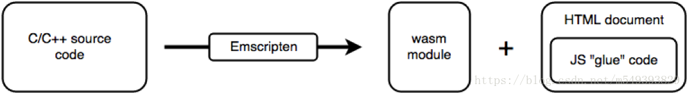

# WebAssembly——从入门到入门

*文章内容来自于在腾讯MIG实习时我在组内做的技术分享*

### 产生背景
WebAssembly官网上，提出一种观点：传统的网络架构可以分为两层，一层是运行web app的虚拟机，一层是web API。可以理解为虚拟机层用于计算，实现交互功能，而web API层负责实现展示

**JS性能瓶颈**

一直以来，虚拟机层只需要加载js就够了。因为js的功能足够强大，而且随着这20多年的发展历史，js自身也得到了很充分的扩展，形成了完善的生态系统。但是，功能提升的同时，js也慢慢变得臃肿了起来。并且，随着web应用范围的逐渐扩大，js逐渐显得力不从心

比如，我们在google上搜索“js 性能“，有将近两千万条结果。前端面试中也常见到性能优化问题。这充分说明了js性能问题始终是前端方向的热点问题。

虽然现在有了node和高效的v8引擎，但是在计算复杂性任务上，js性能还是远远落后于传统编译型语言

**Web应用范围扩大**

如今，web的应用范围已经不再是简单的资源展示和提供了。近些年来，基于web的VR，AR技术，3D游戏等都有蓬勃的发展，例如我们818活动“发烧星球”玩法，就是一个web VR的实用例子

虽然也有类似WebGL这样的高性能框架出现，通过连接OpenGL的底层接口，为原本极度十分耗时的h5 canvas渲染提供3D硬件加速，大大提高了js在图像处理上的能力。但是我们日常面对的很多业务，由于面向用户范围很大，必须要考虑到兼容性的问题。在很多场景上我们并不能使用新技术，只能用canvas来保证兼容。从这个角度看来，js依旧存在着很大的劣势

**总结一下，js的问题主要来源于以下两点：**
- js作为一门动态语言，缺少编译过程，直接由浏览器解释执行。虽然对于开发者十分友好，但与此同时，js运行时需要大量的类型推导，也就是说需要在运行时动态决定的计算量太大（需要做大量分支预测），造成其效率远低于传统编译型语言。这也就是所谓的“牺牲了部分性能，换取了更强的表现力”
- web应用范围的扩大使得js必须面对更多更复杂的场景。这远远不是js设计时所预想到的（毕竟第一版js只用了10天就做出来了……）

### WebAssembly - 入门

**WebAssembly是一种小体积，高加载速度的二进制编码格式**

从名字就能知道，这是一门底层汇编级的语言。有了WebAssembly，我们的虚拟机层就将会同时加载和运行两种类型的代码——JavaScript和WebAssembly。
这两种代码可以通过WebAssembly所提供的js api实现互相调用。事实上，WebAssembly代码的基本单元被称作一个模块，并且这个模块在很多方面都和ES2015的模块是等价的。所以我们可以认为WebAssembly模块是一个“高性能的JS函数”

**WebAssembly不是用来取代JavaScript的。**它被设计为和JavaScript一起协同工作，从而使得网络开发者能够利用两种语言的优势

WebAssembly设计的目的不是为了手写汇编级别代码，而是为诸如C、C++等低级源语言提供一个高效的编译目标，使得以各种语言编写的代码都可以以接近原生的速度在web中运行。这一点具有重大的意义，这意味着所有由传统语言编写的客户端app都可以在web上高效运行，也就是说在未来客户端全面web化，未来可能不再需要客户端app

同时，WebAssembly也是一个W3C标准，制定过程中得到了各大浏览器厂商积极参与。各大厂商都参与到标准制定里并不常见，像js引擎，css标准，每个浏览器实际都有一套自己的标准。而获得各个厂商支持的WebAssembly在我看来，是未来的标准风向，会被广泛采用

### WebAssembly优势

- 高效，跨平台

  WebAssembly是二进制的，可以直接在WebAssembly虚拟机上的机器代码（可以类比于jvm 字节码）

  类比于汇编，如果机器的指令集和架构相同，则机器码可以直接执行，不关心上层os环境。Webassembly也一样能在不同平台上获得高效执行

- 沙箱化执行环境

  WebAssembly被限制运行在一个虚拟的的沙箱执行环境中，运行时产生的变化可以随后删除，不会对系统产生永久性影响。并且它严格遵循浏览器的同源策略和授权策略，进一步确保了安全性

- 有文本格式，可读可调试

  类比于汇编。每一条指令有对应的二进制值

- 无版本，标准化

  WebAssembly是无版本，向后兼容的。这一点很有意义，相信大家在开发中也很经常碰到版本带来的一些很坑爹的问题。由于系统体积很大，依赖繁杂，且高级依赖往往不兼容低版本，造成升级时的巨大困难

  其次，WebAssembly无论是在PC端还是移动端，都支持各种浏览器平台

### 几个常见概念

- Module

  一个“代码单元”。包含编译好的二进制代码。可以高效的缓存、共享。未来可以像一个ES2015模块一样导入/导出

- Memory

  连续的，可变大小的字节数组缓冲区。可以理解为一个“堆”

- Table

  连续的，可变大小的类型数组缓冲区。现在table只支持函数引用类型，可以类比为一个“栈”

- Instance
  在Module基础上，包含所有运行时所需状态的实例。如果把Module类比为一个cpp文件，那么Instance就是链接了dll的exe文件

### 构建方法

- 直接汇编文本编写

  WebAssembly使用S-表达式作为文本格式

  S表达式用于表示一棵树。树上的每个一个节点都有一对小括号包围。括号内的第一个标签告诉你该节点的类型，其后跟随的是由空格分隔的属性或孩子节点列表

  劣势显而易见，编码逻辑不容易理解

- 移植一个C/C++程序

  

  这张图是官网上的构建流程图，构建过程中使用了Emscripten——一个基于llvm的编译器，目的是把c/c++编译为asm.js（js的一个真子集）

  我们知道，c和js语法十分相似。所以在c到js的编译过程中，要解决的最重要的问题主要是两点：

  - C/C++是静态类型，js是动态类型
  - C/C++需要程序员手动管理内存，js则有自己的一套垃圾回收机制

  因此，就出现了asm.js。asm.js只有两种静态类型（i32, f64），并取消js的垃圾回收（手动管理内存）。浏览器加载到asmjs时，不进行语法分析，直接翻译为机器码执行

  实际上，asm.js就是WebAssembly的一种文本格式，但不同于之前提到的s表达式。这一点类比于c，汇编语言，机器码之间的关系

由于WebAssembly当前不能直接调用Web API（如存取DOM），它只能调用JavaScript，因此需要一段js胶水代码使WebAssembly能够调用到Web API

移植代码缺点在于需要较复杂的依赖，相比之下，汇编编写依赖都由程序员自己定义

### 使用方法
WebAssembly的模块在很大程度上和ES2015模块类似。在使用上也是分为两步：加载和调用

- 加载

  - 获取.wasm二进制模块文件

  - 编译为Module

  - 实例化为Instance

    由于获取，编译和实例化都是异步的，所以实际使用中为了方便，可以直接构建一个异步的loader对wasm进行加载

- 调用：从Instance中获取函数接口

### 性能对比
使用斐波那契数列作为计算函数（C代码如下）

```
void fibonacci(int n)
{
    int first = 0, second = 1, next;
    for (int i = 0; i < n; i++)
    {
        next = first + second;
        first = second;
        second = next;
    }
}
```


重复计算一百万次斐波那契数列46项（47项会溢出），结果如下：

- C：3ms
- JS： 70ms
- WebAssembly：11ms

可以看出，WebAssembly在计算复杂型任务中效率远胜过原生JS

（性能测试部分代码详见[WebAssembly_test_demo](https://github.com/Silence-Rain/WebAssembly_test_demo)）
